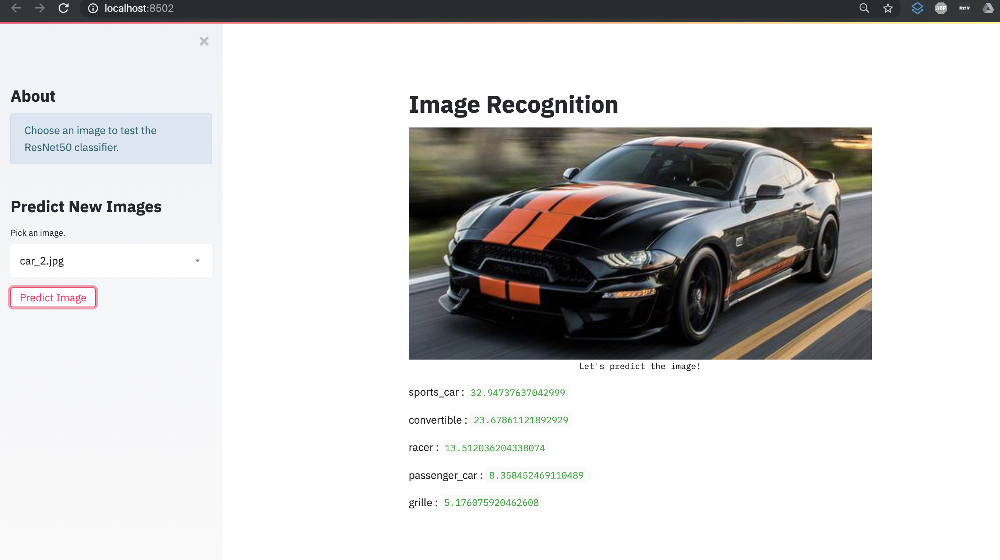

# Image Recognition Web Application  
Author: Xavier M. Puspus  

### Deployed Application  
Here's a [link](https://image-recognition-xmp.herokuapp.com/) to the web application hosted in Heroku.

### Description
I used a pre-trained image recognition model and built a web application that shows how the model classifies the image.

### ResNet50

You can get the [pre-trained model](https://github.com/fchollet/deep-learning-models/releases/download/v0.2/resnet50_weights_tf_dim_ordering_tf_kernels.h5) here. The images I uploaded are taken from Google images.
 

### Deployment Through Web Application

I used the most recently released API of [Streamlit](https://streamlit.io) to deploy the ml model and locally serve the web app.

### Running the App

In order to run the app, you must have the basic data science packages available on your machine, (`pandas`, `numpy`, `seaborn`, `matplotlib`, `sklearn` and install streamlit using:

```console
foo@bar:~$ pip install streamlit
```
Afterwards, `cd` into the directory of `app.py` and run this on the terminal:

```console
foo@bar:~$ streamlit run app.py
```

### Display

The web app should look something like this:


